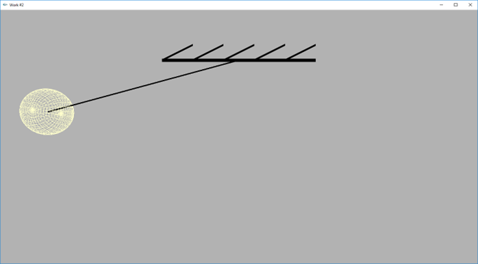
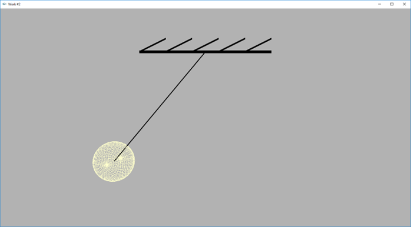
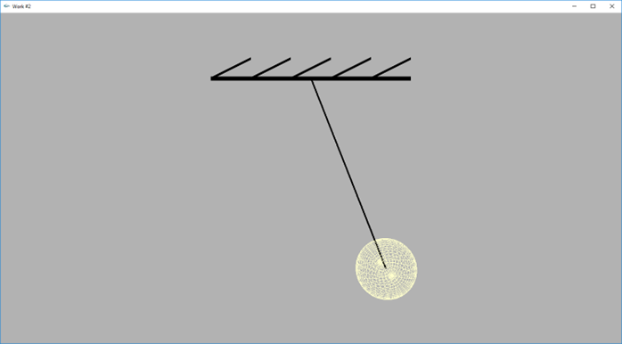
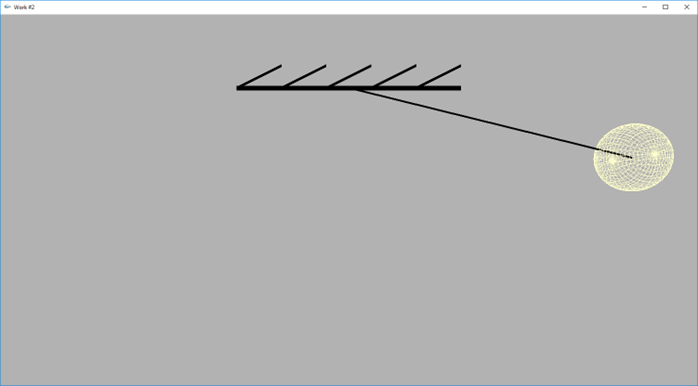

# Pendulum Simulation with OpenGL

This project demonstrates a 3D simulation of a pendulum using OpenGL. The pendulum is animated to show its swinging motion, providing a visual representation of a simple harmonic oscillator.

## Code Overview

The code utilizes OpenGL and GLUT (OpenGL Utility Toolkit) to render and animate a pendulum. The pendulum swings back and forth, and the scene includes a supporting structure and a swinging ball to visualize the motion.

### Key Components

- **`initRendering`**: Sets up OpenGL rendering options, such as enabling depth testing.
- **`handleResize`**: Adjusts the viewport and projection matrix when the window is resized.
- **`drawScene`**: Clears the screen, draws the pendulum, and updates its position and rotation based on sinusoidal motion.
- **`update`**: Updates the rotation angle of the pendulum and triggers a redraw of the scene.

## Results

The animation visualizes the dynamics of a pendulum. The following images show different stages of the pendulum's motion:

| Step 1 | Step 2 |
|--------|--------|
|  |  |

| Step 3 | Step 4 |
|--------|--------|
|  |  |

These images illustrate the pendulum's swing and its position at various points in time.

## Dependencies

- OpenGL
- GLUT (OpenGL Utility Toolkit)

## Usage

1. Compile the code using an OpenGL-compatible compiler.
2. Run the executable to see the animation of the pendulum.
3. Observe the generated images to analyze the pendulum's motion and dynamics.
